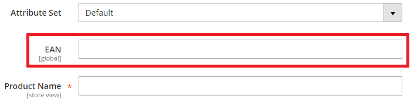
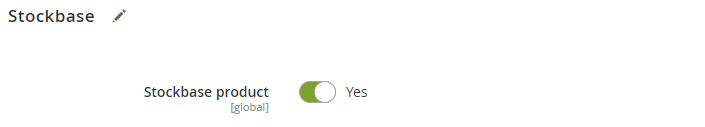

# Configuration 

## Module Configuration

You can find all module configuration options in your Magento admin panel: navigate to 
**Stores** -> **Configuration** -> **Stockbase** -> **Configuration**.

The module will be disabled by default. To enable the module, fill in all required options:

* **Your Stockbase username and password:** please specify the username and password you use to access your Stockbase 
control panel.
* **Environment selection:** this depends on your Stockbase account type. If you're not sure of the type, select 
`Production` mode.
* **Product EAN field:** European Article Number (also known as EAN) is used as a unique identifier of 
an individual Stockbase product.

To associate your Magento product with a Stockbase product, specify the product's EAN in an attribute.
If you don't have such attribute, you can click the **Create EAN attribute** button to create it automatically.

## Product Configuration

To enable Stockbase functionality for a product, set the **Stockbase product** attribute to `Yes` and associate your 
Magento product with the corresponding Stockbase product by filling in the **EAN** field 
([configured in the module settings](#ean-field)). 

The module only works for the product if:

1. The product type is "Simple product."
2. The product's "Stockbase product" option is set to `Yes`.
3. Back orders are disabled for the product.
4. The [EAN field](#ean-field) is not empty.
5. The local copy of the Stockbase index includes the product that has the EAN specified in the [EAN field](#ean-field).

