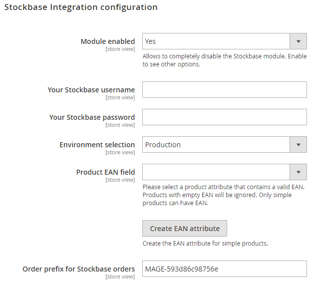

# Configuration {#configuration}


## Module settings

You can find all module configuration options in your Magento admin panel:  
Navigate to **Stores** -> **Configuration** -> **Stockbase** -> **Configuration**.


By default, module will be disabled.

To enable the module, you should fill in all required options:

```{r echo = FALSE, out.width = "65%"}

```

#### Your Stockbase username and password {.unnumbered}

Please specify your username and password that you're using to access your stockbase control panel.


#### Environment selection {.unnumbered}

Depends on type of your Stockbase account. If you're not sure, select the **Production** mode.


#### Product EAN field {#ean-field .unnumbered}

To associate your Magento product with a Stockbase product, you should specify the product's EAN in an attribute.
If you don't have such attribute, you can click on the **Create EAN attribute** button and it will be created automatically.

